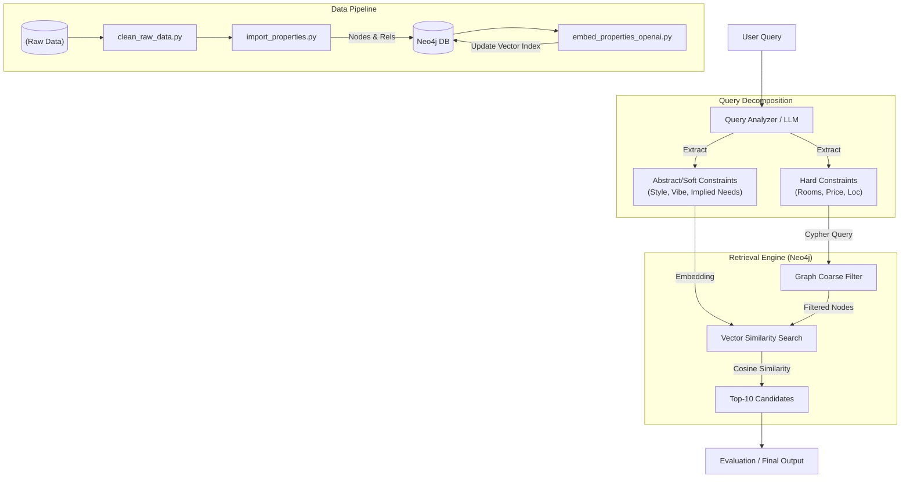

# Task 1 – RAG System for Precise Property Retrieval

## 1.1 Problem Definition

### Objective

Design and implement a **Retrieval-Augmented Generation (RAG)** system for a property listing dataset. The system must handle *
*VLM-generated descriptions** and metadata to answer user queries ranging from specific constraints to abstract requirements.

### Core Requirements

1. **Retrieval:** Implement a vector-based retrieval layer.
2. **Query Handling:** Support queries like:
    * *Specific:* "Find a property with a bright living room and open kitchen layout."
    * *Abstract:* "Show me the one that looks minimal Scandinavian."
    * *Negative/Constraint:* "Which property has a narrow corridor?"
3. **Output:** Provide Top-3 recommendations with **evidence-based citations** and explainable answers.

---

## 1.2 Design Choices and Trade-offs

### Why Hybrid Search (Graph + Vector)?

Property data is unique because it contains two distinct types of information:

1. **Structured Data (Hard Constraints):** Price, number of rooms, square footage, location.
2. **Unstructured Data (Soft/Abstract Constraints):** Architectural style, "feeling" of the room, implied needs (e.g., "I have a
   lung condition" implies a need for good ventilation/air quality).

**Decision:**
We utilized **Neo4j** as the core database to perform **Hybrid Search**.

* **Graph (Cypher):** Handles hard constraints efficiently (e.g., `WHERE price < 20000000`).
* **Vector Index:** Handles semantic similarity for descriptions (e.g., matching "Scandinavian" to property descriptions).

**Trade-off:**
Using a GraphDB adds complexity compared to a simple VectorDB (like Chroma or Pinecone). However, a pure VectorDB struggles with
precise numerical filtering (e.g., exact bedroom counts or strict budget ranges), often leading to hallucinations or irrelevant
results. The Graph approach ensures structural accuracy before semantic matching.

### Retrieval Unit Strategy

* **Unit of Retrieval:** Property Level (Node).
* **Chunking Strategy:** We treat the VLM-generated description as a primary property attribute. Instead of chunking the text
  into arbitrary sizes, we embed the holistic description of the property to maintain context, while allowing specific
  room-level tags to exist as connected nodes or properties in the graph.

---

## 1.3 System Architecture

The system follows a **Filter-then-Rank** workflow.

### Workflow Description

1. **Query Analysis:** The user query is processed by an LLM to extract:
    * **Hard Constraints:** (e.g., 3 bedrooms, budget < $20M).
    * **Soft/Abstract Intents:** (e.g., "minimalist style", "good for health").
2. **Coarse Filtering (Cypher):** Hard constraints are converted into a Cypher query to narrow down the search space within
   Neo4j.
3. **Vector Search:** The "Soft Intents" are embedded using OpenAI's embedding model. We perform a vector similarity search
   *only* on the nodes that passed the Coarse Filter.
4. **Top-K Selection:** The system returns the Top-10 most similar properties based on vector distance.
5. **Response Generation:** (Currently, the focus is on the retrieval accuracy of the Top-10).

### Architecture Diagram

---

## 1.4 Implementation & Reproduction Steps

To reproduce the current state of the task, follow this pipeline:

### Step 1: Data Cleaning

Raw data is processed to standardize strings and combine relevant fields.

* **Script:** `scripts/property_search_recommendation/clean_raw_data.py`
* **Output:** `data/cleaned_twhg_with_latlng_and_places/`

### Step 2: Graph Ingestion

Cleaned data is converted into Graph Nodes (Properties) and Relationships.

* **Script:** `scripts/property_search_recommendation/import_properties.py`
* **Action:** Connects to Neo4j and populates the database.

### Step 3: Embedding Generation

We generate vector embeddings for the property descriptions (specifically targeting the VLM/Description fields).

* **Script:** `scripts/property_search_recommendation/embed_properties_openai.py`
* **Model:** OpenAI Embedding Model.

### Step 4: Evaluation Dataset Generation

We generated synthetic testing data to validate the retrieval logic.

* **Script:** `scripts/property_search_recommendation/generate_tesing_dataset.py`
* **Strategy:** For every property, generate 10 questions (5 specific/explicit, 5 abstract/implicit).
* **Datasets:**
    * `v1`: Initial attempt. Queries were too rough/generic.
    * `v2`: Improved via prompt tuning to include more specific details, enabling better recall testing.

### Step 5: End-to-End Evaluation

An automated script runs the generated queries against the system to calculate **Recall@10**.

* **Goal:** Recall > 50% (Given the hybrid nature of the queries).

---

## 1.5 Assumptions and Limitations

### Current Limitations

1. **Recall Issues with V1 Dataset:** The initial evaluation report (`reports/task_1/v1_task1_evaluation_report.md`) showed poor
   performance. This was due to the testing queries being too generic (e.g., "Find a 3-bedroom house"), causing the ground-truth
   property to be buried outside the Top-10 results simply due to high volume of matches.
2. **Room Name Ambiguity:** The system currently relies on text matching or simple embeddings for room names. However, semantic
   overlap exists (e.g., "Living Room" vs. "Living/Dining" vs. "Dining Room"). These are not strictly normalized, leading to
   potential misses in the Graph Filter stage if the user asks for a "Dining Room" but the data says "Living/Dining".
3. **No Reranking:** Currently, we rely on the vector score for the final order. We have not yet implemented a Cross-Encoder
   Reranker to refine the Top-10 into a precise Top-3.

### Assumptions

* The "Abstract" queries (e.g., lung cancer -> ventilation) assume the LLM can correctly infer the physical property
  requirement (ventilation) from the user's intent before querying the database.

---

## 1.6 Future Roadmap

### Immediate Next Steps

1. **Chain-of-Thought (CoT) Query Planning:**
    * Implement a planning step where the LLM explicitly reasons about the user's query before searching.
    * *Example:* User: "I have lung cancer." -> CoT: "User needs clean air. Look for 'ventilation', 'windows in bathroom', 'near
      parks', 'away from factories'." -> Search.
2. **Room Entity Normalization:**
    * Refine the data ingestion to handle room synonyms via a taxonomy or ontology in Neo4j (e.g.,
      `(Living Room)-[:SAME_AS]->(Living/Dining)`).
3. **Reranking Layer:**
    * Implement a reranking step (e.g., Cohere Rerank or BGE-Reranker) on the Top-10 results to improve precision for the final
      Top-3 output.

### System Observability (LangGraph + Langfuse)

* **LangGraph:** Refactor the linear pipeline into a stateful graph workflow. This allows for cyclic logic (e.g., if 0 results
  found, relax constraints and retry).
* **Langfuse:** Integrate tracing to observe the inputs and outputs of every node (Query Analyzer, Retriever, Generator). This
  is crucial for debugging why a specific property was *not* retrieved.